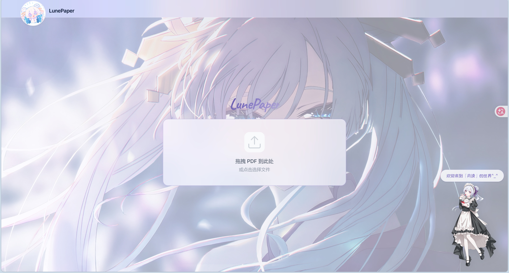

<div align="center">


<br><br>


# 月读 · LunePaper

**本地化的科研论文 PDF 智能翻译工具**

<br>


</div>

---

<br>

<div align="center">

<br><br>
<em>LunePaper 动态运行效果展示</em>
</div>

<br>

---

##  月读是什么

月读是一个 **纯本地运行** 的 PDF 学术论文深度翻译器。只需上传英文学术 PDF，系统即可全自动完成文档版面分析、OCR 识别、领域约束学术翻译与实时双语对照排版，最终一键导出内嵌高清图表与数学公式的 **100% 离线自包含双语 HTML 文档**。

**全程不依赖任何第三方云端 API，数据零泄露，离线可用。**

```
  PDF 上传  ──►  双底座 OCR 识别  ──►  领域约束翻译  ──►  双语对照流式阅读  ──►  离线 HTML 导出
```

<details>
<summary><b>系统架构与工作流</b></summary>
<br>

```
┌─────────────────┐       REST + WebSocket        ┌─────────────────┐
│    Frontend     │ ◄═══════════════════════════► │     Backend     │
│   React + TS    │     逐块流式推送信令与文本      │  FastAPI Router │
│ Tailwind + KaTeX│                               │ Task & Worker   │
└─────────────────┘                               └────────┬────────┘
                                                           │ ctypes / C-ABI
                                                  ┌────────▼────────┐
                                                  │      Infer      │
                                                  │ llama & mtmd.dll│
                                                  └────────┬────────┘
                                                           │ GPU 推理
                                 ┌─────────────────────────┴─────────────────────────┐
                                 ▼                                                   ▼
                     ┌───────────────────────┐                           ┌───────────────────────┐
                     │     OCR 引擎底座       │                           │     学术翻译引擎       │
                     │ Unlimited-OCR (3B MoE)│                           │   Hy-MT2-1.8B (Q8_0)  │
                     │ OvisOCR2 (0.8B Dense) │                           │ 动态术语约束 + 质量回译 │
                     └───────────────────────┘                           └───────────────────────┘
```

</details>

<br>

---

## 核心特性

| 特性分类 | 核心亮点 | 技术说明 |
|:---|:---|:---|
| **双底座 OCR 引擎** | **按需动态切换** | • **Unlimited-OCR**：3B MoE (64×550M)<br>• **OvisOCR2**：0.8B Dense (752M)，显存仅需 **1.7GB**。 |
| **结构化论文速读** | **四维核心提炼** | 基于大模型自动从论文摘要与引言中提炼背景痛点、创新方法、实验基准与学术价值，30 秒速览论文全貌。 |
| **学者机构对齐** | **元数据智能识别** | 自动提取学者阵容、多重学术机构、通讯邮箱与特殊符号脚注，以扁平胶囊整齐排布。 |
| **全量公式与变量词典**| **KaTeX + 符号字典** | 支持行内公式 `$..$` 与独立块级公式 `$$..$$`；独家提供变量词典，智能解析公式关键符号并支持全篇符号字典。 |
| **文献引用即时溯源** | **悬浮即显卡片** | 正文引用角标悬浮直读文献详情，提供 Google 学术、arXiv 快捷跳转及原文原位定位。 |
| **算法代码拟物排版** | **语法深度高亮** | 现代代码视窗，支持 PyTorch 等主流框架深度高亮、行号对齐与一键复制代码。 |
| **领域术语约束** | **学术级专名一致性** | 基于论文研究方向提取动态上下文，注入领域学术术语库（Transformer、CV等），杜绝专有名词误译。 |
| **离线 markdown 导出** | **100% 自包含交付** | 导出的 markdown 文件直接**全量内嵌 KaTeX 引擎与样式**，无外部 CDN 依赖。 |
| **实时流式推送** | **零等待对照阅读** | 逐页 OCR → 逐块分批翻译 → WebSocket 纳秒级推送到前端，翻译与阅读同步进行。 |
| **PDF 双栏对照** | **版面原位对照** | 一键开启右侧原版高保真 PDF 视口，缩略图、原页、译文三位一体实时导航联动。 |

<br>

---

## 学术精读与现代化交互排版

月读不仅提供严谨准确的学术级双语翻译，更在排版、公式解析与文献溯源等精读体验上进行了深度创新：

| 论文结构化速读 (Paper TL;DR) | 学者团队学术机构对齐 |
| :---: | :---: |
| <br><sub>四维提炼研究背景、核心创新、实验指标与学术价值</sub> | <br><sub>智能识别作者阵容、多重机构与特殊符号脚注元数据</sub> |
| **公式深度解析与变量词典** | **文献引用即时悬浮与智能溯源** |
| <br><sub>高保真 LaTeX 公式渲染、关键变量释义与全篇符号字典</sub> | <br><sub>引用角标悬浮直读文献详情，直达 Google 学术与 arXiv</sub> |
| **算法实现与代码高亮排版** | **简洁视窗** |
| <br><sub>现代代码视窗，支持 PyTorch 语法高亮与一键复制</sub> | <br><sub> 全模态沉浸精读</sub> |

<br>

---

##  模型矩阵

| 模型名称 | 架构 / 参数量 | 显存占用 | 量化精度 | 适用场景 | 官方权重链接 |
|:---|:---:|:---:|:---:|:---|:---:|
| **Unlimited-OCR** | 3B MoE (64×550M) | ~6.0 GB | Q8_0 | 长篇标准文献全自动批处理 | [HuggingFace](https://huggingface.co/sahilchachra/Unlimited-OCR-GGUF) |
| **mmproj-Unlimited** | 视觉投影器 | — | F16 | Unlimited-OCR 视觉编码支持 | 同上 |
| **OvisOCR2** | Qwen-VL 0.8B (752M) | **~1.7 GB** | Q8_0 | 密集数学公式、跨页嵌套表格、轻量显存设备首选 | [HuggingFace](https://huggingface.co/AIDC-AI/Ovis-Clip) |
| **mmproj-BF16** | 视觉投影器 | — | BF16 | OvisOCR2 视觉编码支持 | 同上 |
| **Hy-MT2** | 1.8B Dense | ~2.5 GB | Q8_0 | 英→中高质量学术翻译，专业术语理解透彻 | [HuggingFace](https://huggingface.co/tencent/Hy-MT2-1.8B-GGUF) |

<br>

---

##  硬件配置参考

得益于双 OCR 引擎设计，月读能够自适应不同显存梯度的设备：

| 运行配置 | 最低 GPU 显存 | 典型显卡设备 | 性能表现 |
|:---:|:---:|:---|:---|
| **模式1**<br>`OvisOCR2 + Hy-MT2` | **4 GB+ VRAM** | RTX 3050 / RTX 4050 / GTX 1660 / 移动工作站 | 显存占用低，公式与表格解析极佳 |
| **模式2**<br>`Unlimited-OCR + Hy-MT2` | **8 GB+ VRAM** | RTX 4060 / RTX 3070 / RTX 4070 及以上 | 得益于moe架构，速度更快 |

> 系统内存推荐 16GB 及以上；支持 Windows / Linux / macOS。

<br>

---

##  快速开始

### Step 1 · 克隆仓库

```bash
git clone https://github.com/yourname/LunePaper.git
cd LunePaper
```

### Step 2 · 准备 llama.cpp 核心动态库

项目通过高效的 ctypes C-ABI 绑定底层推理库（`llama.dll` + `mtmd.dll` 或 Linux `.so`），无需启动重量级本地服务：

<details>
<summary><b>Windows（VS 2022 + CUDA 编译指南）</b></summary>

```powershell
git clone https://github.com/ggml-org/llama.cpp.git
cd llama.cpp

cmake -B build_min -G Ninja `
  -DCMAKE_BUILD_TYPE=Release `
  -DBUILD_SHARED_LIBS=ON `
  -DGGML_CUDA=ON `
  -DLLAMA_BUILD_COMMON=OFF `
  -DLLAMA_BUILD_TESTS=OFF `
  -DLLAMA_BUILD_TOOLS=OFF `
  -DLLAMA_BUILD_EXAMPLES=OFF `
  -DLLAMA_BUILD_SERVER=OFF `
  -DLLAMA_BUILD_APP=OFF `
  -DLLAMA_BUILD_MTMD=ON

cmake --build build_min --config Release --target llama mtmd -j 8
cp build_min/bin/*.dll ../LunePaper/
```

</details>

<details>
<summary><b>Linux（GCC + CUDA 编译指南）</b></summary>

```bash
git clone https://github.com/ggml-org/llama.cpp.git
cd llama.cpp

cmake -B build_min -G Ninja \
  -DCMAKE_BUILD_TYPE=Release \
  -DBUILD_SHARED_LIBS=ON \
  -DGGML_CUDA=ON \
  -DLLAMA_BUILD_COMMON=OFF \
  -DLLAMA_BUILD_TESTS=OFF \
  -DLLAMA_BUILD_TOOLS=OFF \
  -DLLAMA_BUILD_EXAMPLES=OFF \
  -DLLAMA_BUILD_SERVER=OFF \
  -DLLAMA_BUILD_APP=OFF \
  -DLLAMA_BUILD_MTMD=ON

cmake --build build_min --target llama mtmd -j $(nproc)
cp build_min/bin/*.so ../LunePaper/
```

</details>

### Step 3 · 下载模型权重

将模型下载并放置于 **项目根目录**：

```bash
# 1. 学术翻译模型 (必需)
wget https://huggingface.co/tencent/Hy-MT2-1.8B-GGUF/resolve/main/Hy-MT2-1.8B-Q8_0.gguf

# 2. 引擎 A: Unlimited-OCR (极速版)
wget https://huggingface.co/sahilchachra/Unlimited-OCR-GGUF/resolve/main/Unlimited-OCR-Q8_0.gguf
wget https://huggingface.co/sahilchachra/Unlimited-OCR-GGUF/resolve/main/mmproj-Unlimited-OCR-F16.gguf

# 3. 引擎 B: OvisOCR2 (高精轻量版)
# 下载 OvisOCR2-Q8_0.gguf 与 mmproj-BF16.gguf 至项目根目录
```

### Step 4 · 环境安装

```bash
# 创建 Python 运行环境
conda create -n lunepaper python=3.10 -y
conda activate lunepaper
pip install -r requirements.txt

# 安装前端依赖
cd frontend
npm install
cd ..
```

### Step 5 · 启动服务

**方式 A · 一键桌面客户端（推荐）**

直接双击运行项目根目录下的 `start.bat`，系统将自动检测环境、托管前后端服务并弹出无边框干扰的原生独立桌面窗口。

**方式 B · 终端独立启动**

```bash
# 终端 1：启动 FastAPI 后端服务 (端口 7860)
python backend/main.py

# 终端 2：启动 Vite 前端服务 (端口 5173)
cd frontend
npm run dev
```

浏览器访问 `http://localhost:5173`，选择您所需的 OCR 底座模型，拖入待翻译的论文 PDF 即可开启阅读之旅。

<br>

---

## 配置文件说明 (`config.yaml`)

```yaml
# ── 模型与 OCR 底座配置 ──
models:
  translation: "Hy-MT2-1.8B-Q8_0.gguf"
  ocr_default: "unlimited"                 # 默认底座: "unlimited" | "ovis"
  ocr_engines:
    unlimited:
      id: "unlimited"
      name: "Unlimited-OCR"
      model_path: "Unlimited-OCR-Q8_0.gguf"
      mmproj_path: "mmproj-Unlimited-OCR-F16.gguf"
      vram_estimate_mb: 5950
    ovis:
      id: "ovis"
      name: "OvisOCR2"
      model_path: "OvisOCR2-Q8_0.gguf"
      mmproj_path: "mmproj-BF16.gguf"
      vram_estimate_mb: 1730

# ── 推理显存配置 ──
gpu:
  ocr_layers: 99                          # -1 或 99 表示全层卸载至 GPU
  trans_layers: 99

# ── OCR 识别参数 ──
ocr:
  max_tokens: 4096                        # 单页最大生成 Token 数
  n_ctx: 8192                             # 上下文窗口容量
  dpi: 144                                # PDF 渲染像素密度
  penalty_repeat: 1.20                    # 抑制 OCR 重复死循环

# ── 翻译参数 ──
translation:
  chunk_size: 500                         # 长段落自适应分片阈值
  temperature: 0.3                        # 学术翻译低温采样
```

<br>

---

## 项目结构

```
LunePaper/
├── desktop_app.py            # 原生桌面客户端主控 (基于 PyWebView 与 WebView2)
├── start.bat                 # 极简一键启动批处理 (纯 ASCII 编码)
│
├── backend/                  # FastAPI 异步服务端
│   ├── main.py               #   服务主入口与 CORS 中间件配置
│   ├── routes.py             #   REST 路由 (上传/离线HTML生成/模型查询/历史知识库)
│   ├── ws.py                 #   WebSocket 实时流式传输信道
│   ├── worker.py             #   翻译管道编排调度与版面分析
│   └── task_manager.py       #   任务状态与缓存生命周期管理
│
├── infer/                    # 底层 C-ABI 与推理引擎层
│   ├── llama_binding.py      #   llama.cpp ctypes 核心抽象
│   ├── mtmd_binding.py       #   多模态视觉投影视觉张量处理
│   ├── ocr.py                #   双底座统一调度 (Unlimited & Ovis)
│   ├── ovis_parser.py        #   Ovis AST 解析与 LaTeX 规范清洗器
│   ├── translate.py          #   学术基础翻译器
│   └── translate_v2.py       #   领域约束注入与回译验证增强翻译器
│
├── frontend/                 # 现代化 React 前端应用
│   ├── src/
│   │   ├── App.tsx           #   主视图组件 (Portal 首页/双工具集成/状态机)
│   │   ├── api.ts            #   REST 与 WebSocket 统一交互接口
│   │   ├── types.ts          #   前端 TypeScript 强类型定义
│   │   └── components/       #   知识库工作区与 Markdown 编辑器组件
│   ├── package.json
│   └── vite.config.ts
│
├── assets/                   # 项目展示动画 (example.gif)、视觉素材、图标与功能截图
├── config.yaml               # 全局统一业务与模型配置文件
├── config.py                 # 动态配置与参数加载器
└── requirements.txt          # Python 环境依赖清单
```

<br>

---

<div align="center">

**月读 · LunePaper** — 让每一篇学术论文都能被轻松读懂

<br>


*Apache 2.0 License*

</div>
